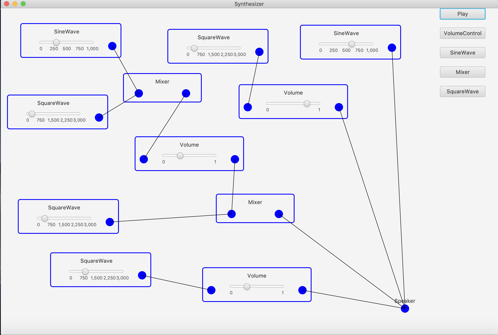

# Synthesizer

A application which can combine multiple kinds of sound waves, adjust their volumes and frequencies, and produce a new sound wave.

## How to run

Just open the project in Intellij, and you'll be fine.

## Screenshot

